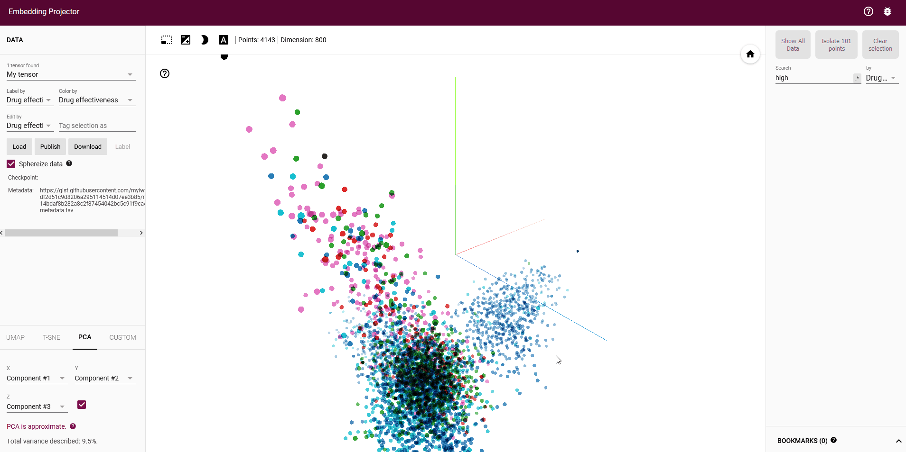

# Text classification of online drug review websites
## Aim

To try and predict the effectiveness of drugs from online drug review websites by using text mining and machine learning techniques.

## Introduction

When new medicines are developed, clinical trials and research need to be undertaken in order to gain approval from the government to sell to the public. Although clinical research processes are highly robust, ultimately they are conducted over a limited sample population over a fixed period of time. At times, long-term effects of drugs or rare side effects may not be uncovered until the drug is sold to the public and a very large amount people are using it. Online drug reviews could potentially be a good source of information to efficiently monitor the success of a drug across a very large population. Furthermore, online reviews are continually updated as new people use drugs, so this could also be a great source for up to date information which could be used to monitor any quality degradations of existing drugs in the market.

## Method

A Bag of Words model is used to represent the text as vectors and the text classification was performed using two supervised machine learning models: Random Forest and Support Vector Machine.

[Projection of drug reviews](http://projector.tensorflow.org/?config=https://gist.githubusercontent.com/myiwt/4f8324e830e14cc1b5032e4b2e486aed/raw/886d1e4594bd4275db50d2b4f26c1978df9f83ab/embedding_projector_config.json)

